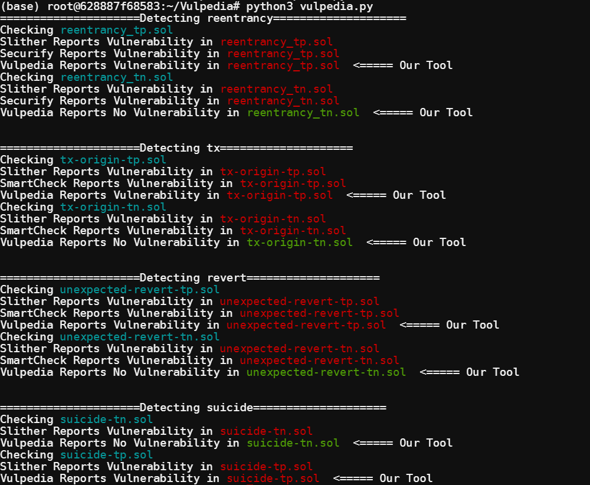

# Demo of Vulpedia

## How to use

* First, download docker container from dockerhub and run the container

```shell
docker pull sdoddyjm67/vulpedia:latest

docker run -it sdoddyjm67/vulpedia
```

* Next, enter the demo folder and run the demo program

```shell
cd /root/Vulpedia

python3 vulpedia.py
```

The program will run detectors (Slither, Smartcheck, Securify and Vulpedia) on example Solidity programs (programs are in the `/root/Vulpedia/demo_code` folder).

The output will be like:



The files named with "tn" mean that the files have no vulnerabilities. However, they are usually incorrectly reported as vulnerability by detectors. And the file with suffix "tp" means that the file is truely with vulnerability.

From the results, we can find that Vulpedia has best performance in distinguishing non-vulnerable file from all candidates.